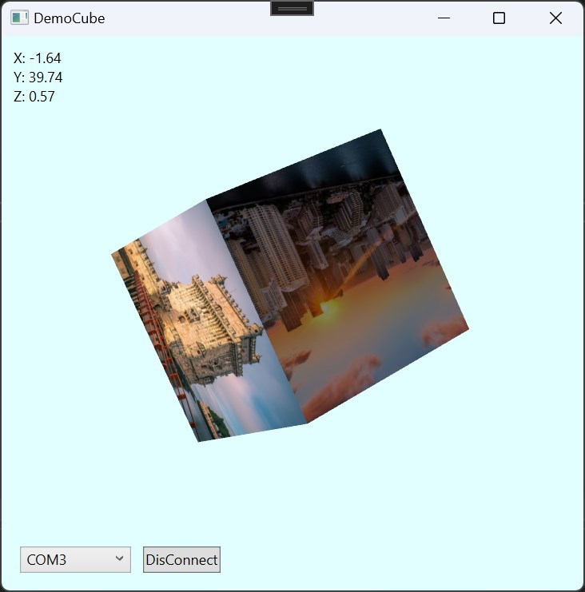

# Port ICM20648 eMD SmartMotion Library run on EFR32BG22 (Thunerboard)

## Refereence documents
 [ICM20648 datasheet](Docs/DS-000179-ICM-20648-v1.5.pdf)

 [Thunerboard datasheet](Docs/ug415-brd4184a-user-guide.pdf)

 ## eMD SmartMotion

 ### Version

 1.0.5

 ### Support Function

 

 The function `Game Rotation Vector` is DMP_QUATER_6

## EFR32BG22 Thunerboard configure

### Base project
Use base project generate for MCU EFR32BG22 (Without Bluetooht Stack and Bootloader)


### Install componenet

- Thunderboard: BRD4184B
- ICM20648 - Motion sensor
- Log
- Assert
- UARTDRV USART: vcom
- Sleeptimer
- IO Stream RTT
- Microsecond Delay
- Other function install base on project generate

#### Note
Check the [Thunderboar datasheet](Docs/ug415-brd4184a-user-guide.pdf) to configure GPIO pin correct with sensor and periapheral usage.


### Add eMD SmartMotion library and Port

copy [SmartMotion_ICM20648_1.0.5](eMD-SmartMotion_ICM20648_1.0.5) to project root director and change name to `ICM20648`

Copy and update source [system.h](eMD-SmartMotion_ICM20648_1.0.5/EMD-App/src/ICM20648/system.h) [system.c](eMD-SmartMotion_ICM20648_1.0.5/EMD-App/src/ICM20648/system.c) [sensor.h](eMD-SmartMotion_ICM20648_1.0.5/EMD-App/src/ICM20648/sensor.h) [sensor.c](eMD-SmartMotion_ICM20648_1.0.5/EMD-App/src/ICM20648/sensor.c) to suitable with EFR32BG22 MCU

Implement `inv_icm` in `app_init` and `app_run` of [app.c](base_project_thunderboard_mcu/app.c)

```c
void app_init(void) {
	int rc = 0;

	// IMU Interrupt configure
	unsigned int interrupt;
	CMU_ClockEnable(cmuClock_GPIO, true);
	GPIO_PinModeSet(gpioPortB, 3, gpioModeInput, 0);
	interrupt = GPIOINT_CallbackRegisterExt(3,
			(GPIOINT_IrqCallbackPtrExt_t) icm20648_on_change,
			NULL);

	// IMU init
	sl_status_t sc;
	sc = sl_board_enable_sensor(SL_BOARD_SENSOR_IMU);
	app_assert_status(sc);

	sc = sl_icm20648_init();
	app_assert_status(sc);

	//========================================================================//
	// eMD Library init
	//========================================================================//
	struct inv_icm20648_serif icm20648_serif;
	icm20648_serif.context   = 0; /* no need */
	icm20648_serif.read_reg  = idd_io_hal_read_reg;
	icm20648_serif.write_reg = idd_io_hal_write_reg;
	icm20648_serif.max_read  = 1024*16; /* maximum number of bytes allowed per serial read */
	icm20648_serif.max_write = 1024*16; /* maximum number of bytes allowed per serial write */

	icm20648_serif.is_spi    = interface_is_SPI();
	inv_icm20648_reset_states(&icm_device, &icm20648_serif);

	/*
	 * Setup the icm20648 device
	 */
	icm20648_sensor_setup();

	/*
	* Now that Icm20648 device was initialized, we can proceed with DMP image loading
	* This step is mandatory as DMP image are not store in non volatile memory
	*/
	rc += load_dmp3();
	check_rc(rc, "Error sensor_setup/DMP loading.");

	// Enable interrupt
	GPIO_ExtIntConfig(gpioPortB, 3, interrupt,
	false,
	true,
	true);

	inv_icm20648_enable_dmp_quater_6();
}
```

Convert quaternion to angle
```c
	int32_t Q1 = (int32_t)async_edata.d.async.sensorEvent.vdata.data.u32[1];
	int32_t Q2 = (int32_t)async_edata.d.async.sensorEvent.vdata.data.u32[2];
	int32_t Q3 = (int32_t)async_edata.d.async.sensorEvent.vdata.data.u32[3];
    double q1 = ((double)Q1) / 1073741824.0; // Convert to double. Divide by 2^30
    double q2 = ((double)Q2) / 1073741824.0; // Convert to double. Divide by 2^30
    double q3 = ((double)Q3) / 1073741824.0; // Convert to double. Divide by 2^30
    double q0 = sqrt(1.0 - ((q1 * q1) + (q2 * q2) + (q3 * q3)));
    double q2sqr = q2 * q2;
    // roll (x-axis rotation)
    double t0 = +2.0 * (q0 * q1 + q2 * q3);
    double t1 = +1.0 - 2.0 * (q1 * q1 + q2sqr);
    double roll = atan2(t0, t1) * 180.0 / PI;
    // pitch (y-axis rotation)
    double t2 = +2.0 * (q0 * q2 - q3 * q1);
    t2 = t2 > 1.0 ? 1.0 : t2;
    t2 = t2 < -1.0 ? -1.0 : t2;
    double pitch = asin(t2) * 180.0 / PI;
    // yaw (z-axis rotation)
    double t3 = +2.0 * (q0 * q3 + q1 * q2);
    double t4 = +1.0 - 2.0 * (q2sqr + q3 * q3);
    double yaw = atan2(t3, t4) * 180.0 / PI;
```

Port source code focuse on [sensor.c](base_project_thunderboard_mcu/sensor.c) and [system.c](base_project_thunderboard_mcu/system.c) check project for more details

Update `include path`


## Demo

### Application DemoCube



### RTT Log


### [Video](https://www.youtube.com/watch?v=--8RvOhYURk)


